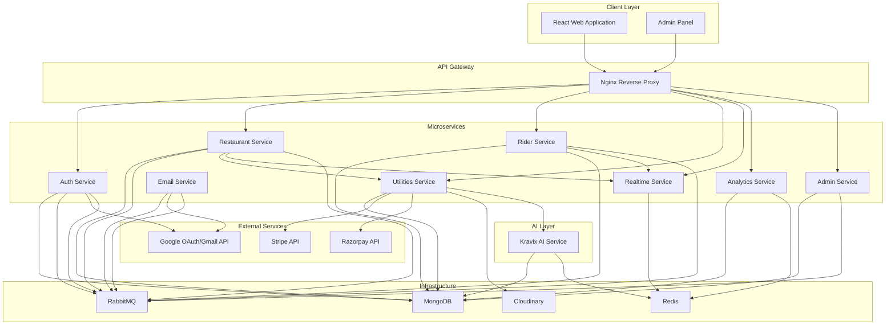
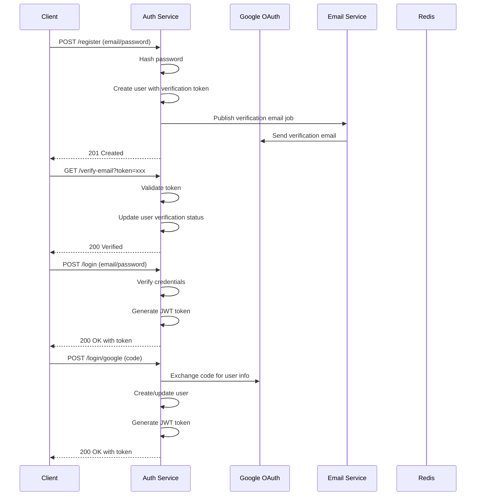
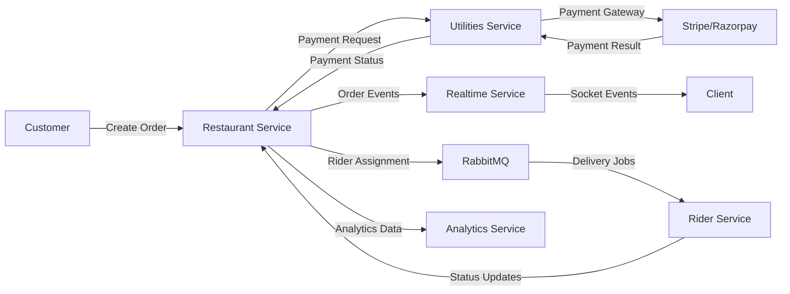
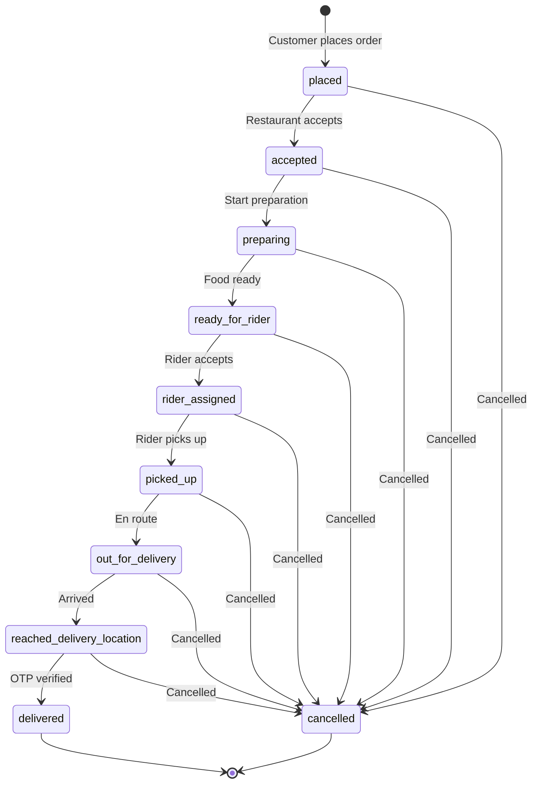
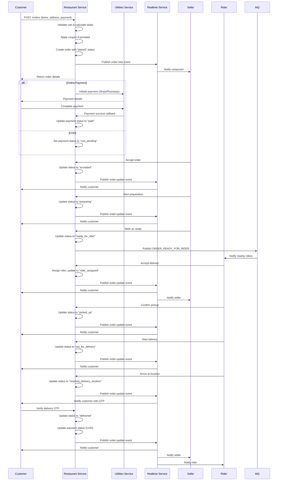
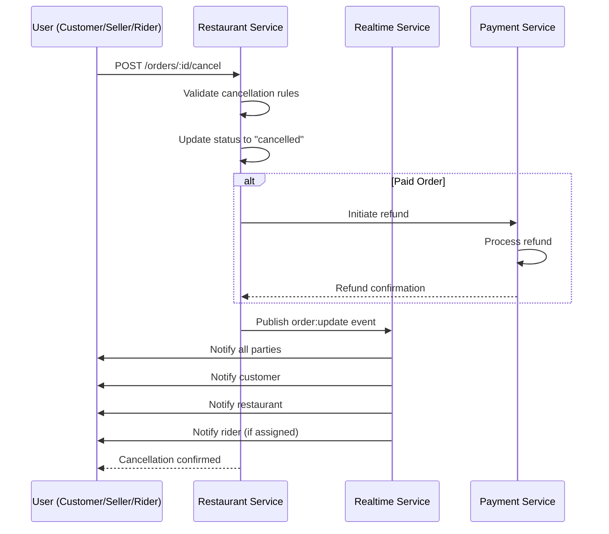
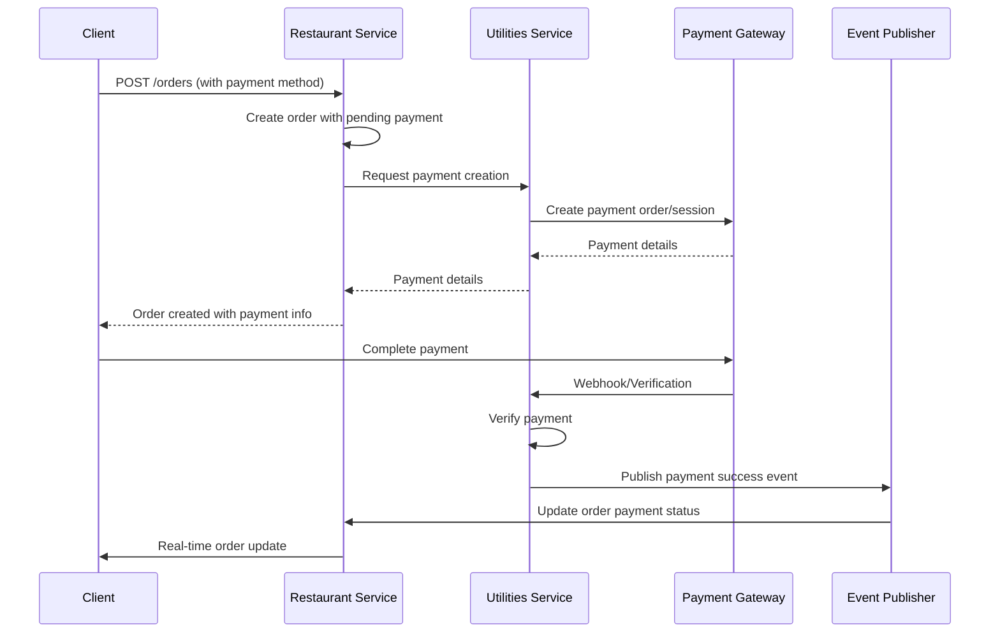
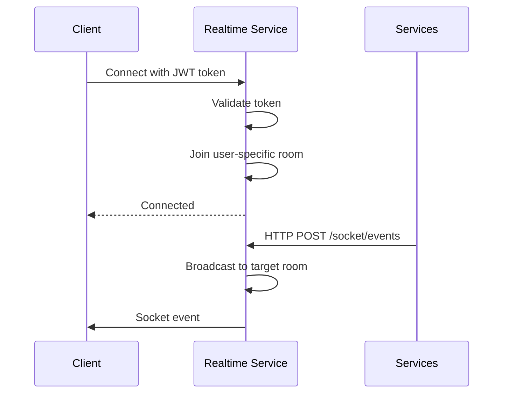
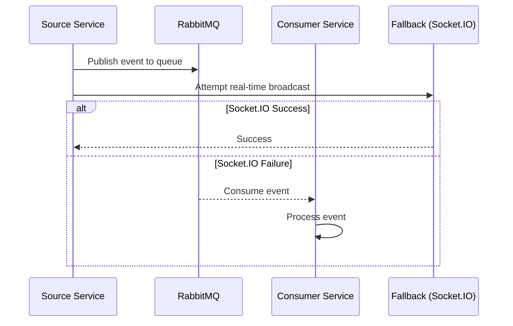
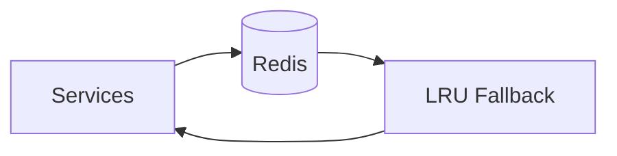

<p align="center">
  
</p>

<h1 align="center">🍛 Kravix — Be Smart, Eat Better</h1>
<p align="center">
  <em>🍔 Craving something delicious? Let's eat again! A production-grade, event-driven online food delivery web application built with a modern TypeScript monorepo architecture.</em>
</p>

---
<p align="center">
  
  
  
  
  
  
</p>

---

## Project Overview

<p align="center">
  <strong>Kravix</strong> is a production-grade, microservices-based food delivery platform designed for scalability and enterprise deployment. Built with modern technologies, it provides a complete solution for customers, restaurants, riders, and administrators with real-time order tracking, AI-powered assistance, and comprehensive analytics.
</p>

Kravix is a comprehensive food delivery platform built on a microservices architecture that separates concerns across independent, scalable services. The platform supports multiple user roles:

- **Customers**: Browse restaurants, place orders, track deliveries, manage addresses
- **Restaurant Sellers**: Manage menus, process orders, track sales analytics
- **Riders**: Accept delivery assignments, track earnings, manage availability
- **Administrators**: Platform oversight, user management, system analytics

The system integrates AI-powered conversational assistance, real-time order tracking via Socket.IO, multiple payment gateways (Stripe, Razorpay, COD), and comprehensive business analytics.

---

## Table of Contents

- [Key Features](#key-features)
- [Technology Stack](#technology-stack)
- [Architecture Overview](#architecture-overview)
- [System Architecture](#system-architecture)
- [Microservices Architecture](#microservices-architecture)
- [Frontend Architecture](#frontend-architecture)
- [AI Service Architecture](#ai-service-architecture)
- [Database Architecture](#database-architecture)
- [Authentication & Authorization](#authentication--authorization)
- [Order Integration](#order-integration)
- [Order Flow](#order-flow)
- [Payment Integration](#payment-integration)
- [Real-time Communication](#real-time-communication)
- [Message Queue Architecture](#message-queue-architecture)
- [Caching Strategy](#caching-strategy)
- [Security](#security)
- [Project Structure](#project-structure)
- [Prerequisites](#prerequisites)
- [Installation](#installation)
- [Environment Configuration](#environment-configuration)
- [Local Development](#local-development)
- [Docker Setup](#docker-setup)
- [Production Deployment](#production-deployment)
- [API Overview](#api-overview)
- [CI/CD Pipeline](#cicd-pipeline)
- [Monitoring & Logging](#monitoring--logging)
- [Performance Optimizations](#performance-optimizations)
- [Contributing](#contributing)
- [License](#license)
- [Maintainer](#maintainer)
- [Acknowledgments](#acknowledgments)

---

## Key Features

### Customer Features
- **Multi-provider Authentication**: Email/password and Google OAuth integration
- **Restaurant Discovery**: Geospatial search with radius-based filtering
- **Menu Management**: Browse menu items with real-time availability
- **Cart System**: Add/remove items, quantity management, coupon application
- **Checkout Process**: Address selection, payment method choice, order confirmation
- **Order Tracking**: Real-time status updates from placement to delivery
- **Order History**: View past orders, reorder items, track order details
- **Address Management**: Save multiple delivery addresses with geolocation
- **Review System**: Rate restaurants and provide feedback

### Restaurant Seller Features
- **Restaurant Registration**: Create restaurant profile with location and images
- **Menu Management**: Add, update, delete menu items with pricing
- **Order Processing**: Accept, prepare, and manage orders
- **Sales Analytics**: Revenue trends, top-selling items, peak hours
- **Availability Control**: Toggle restaurant open/close status
- **Coupon Management**: Create and manage discount codes

### Rider Features
- **Rider Registration**: Profile setup with verification documents
- **Location Tracking**: Real-time GPS location updates
- **Order Assignment**: Accept delivery orders based on proximity
- **Delivery Management**: Update order status, navigate to locations
- **Earnings Tracking**: Monitor total earnings and delivery count
- **Availability Management**: Toggle online/offline status
- **Rating System**: Receive ratings from customers

### Admin Features
- **User Management**: View and manage all platform users
- **Restaurant Oversight**: Monitor restaurant status and performance
- **Rider Management**: View rider profiles and verification status
- **Order Monitoring**: Track all orders across the platform
- **Analytics Dashboard**: Platform-wide business metrics
- **Coupon Management**: Create and manage platform coupons
- **Review Moderation**: Monitor and manage user reviews

### AI Assistant
- **Conversational Interface**: Natural language interaction for food recommendations
- **Context-Aware Responses**: Session-based conversation history
- **Multi-Role Support**: Tailored assistance for customers, sellers, and riders
- **Fallback Mechanism**: Graceful degradation when ML inference unavailable

---

## Technology Stack

### Frontend
- **Framework**: React 19.2.4 with TypeScript 5.9.3
- **Build Tool**: Vite 7.3.1
- **Styling**: TailwindCSS 4.2.1
- **Routing**: React Router DOM 7.13.1
- **State Management**: React Context API
- **HTTP Client**: Axios 1.13.6
- **Real-time**: Socket.IO Client 4.8.3
- **Maps**: Leaflet 1.9.4, React Leaflet 5.0.0, Leaflet Routing Machine 3.2.12
- **Charts**: Recharts 3.8.1
- **Authentication**: @react-oauth/google 0.13.4
- **Payment**: @stripe/stripe-js 8.11.0
- **Icons**: Lucide React 0.577.0, React Icons 5.6.0
- **Notifications**: React Hot Toast 2.6.0
- **Animations**: Canvas Confetti 1.9.4
- **Security**: Crypto-JS 4.2.0

### Backend Microservices (Node.js/TypeScript)
- **Runtime**: Node.js 22 Alpine
- **Language**: TypeScript 5.9.3
- **Framework**: Express 5.2.1
- **Database**: MongoDB with Mongoose 9.6.2
- **Authentication**: JWT (jsonwebtoken 9.0.3), bcryptjs 3.0.3
- **Validation**: Zod 4.4.3
- **Message Queue**: amqplib 0.10.9 (RabbitMQ)
- **Caching**: ioredis 5.4.1 (Redis)
- **Real-time**: Socket.IO 4.8.3
- **Security**: Helmet 8.2.0, CORS 2.8.6, express-rate-limit 8.5.2
- **Compression**: compression 1.8.1
- **API Documentation**: Swagger UI Express 5.0.1
- **File Upload**: Multer 2.1.1
- **Image Processing**: Cloudinary 2.9.0, datauri 4.1.0
- **Payment**: Stripe 20.4.1, Razorpay 2.9.6
- **Email**: Google APIs 171.4.0/173.0.0
- **AI Integration**: @google/generative-ai 0.24.1
- **Scheduling**: node-cron 4.6.0

### AI Service (Python)
- **Runtime**: Python 3.11 Alpine
- **Framework**: FastAPI 0.109.0+
- **Server**: Uvicorn 0.27.0+
- **ML/LLM**: PyTorch 2.1.0+, Transformers 4.37.2+, PEFT 0.7.1+, TRL 0.7.10+
- **Quantization**: bitsandbytes 0.42.0+, accelerate 0.26.1+
- **Data**: datasets 2.16.1+
- **Database**: pymongo 4.6.1+ (MongoDB)
- **Caching**: redis 5.0.0+
- **System Monitoring**: psutil 5.9.0+
- **Rate Limiting**: slowapi 0.1.9+
- **Configuration**: python-dotenv 1.0.0+

### Infrastructure
- **Containerization**: Docker
- **CI/CD**: GitHub Actions
- **Container Registry**: Docker Hub
- **Message Broker**: RabbitMQ
- **Cache**: Redis
- **Database**: MongoDB

---

## Architecture Overview

Kravix follows a microservices architecture with event-driven communication patterns. Each service is independently deployable and communicates via HTTP REST APIs and message queues (RabbitMQ). Real-time communication is handled by a dedicated Socket.IO service.

### Design Principles
- **Service Isolation**: Each microservice has its own database and business logic
- **Event-Driven**: Asynchronous communication via RabbitMQ for decoupled services
- **Real-time**: Socket.IO for instant order status updates
- **Scalability**: Horizontal scaling capability for each service
- **Resilience**: Circuit breakers, retry mechanisms, and fallback strategies
- **Security**: JWT authentication, internal service keys, rate limiting

---

## System Architecture



---

## Microservices Architecture

### 1. Auth Service
**Port**: Configurable via environment  
**Responsibilities**:
- User registration (email/password and Google OAuth)
- User authentication and JWT token generation
- Email verification
- Password reset functionality
- User profile management
- Role assignment (customer, seller, rider)
- Event publishing for user lifecycle events

**Key Endpoints**:
- `POST /api/v1/auth/register` - Email registration
- `POST /api/v1/auth/register/google` - Google registration
- `POST /api/v1/auth/login` - Email login
- `POST /api/v1/auth/login/google` - Google login
- `GET /api/v1/auth/verify-email` - Email verification
- `POST /api/v1/auth/forgot-password` - Initiate password reset
- `POST /api/v1/auth/reset-password` - Complete password reset
- `GET /api/v1/users/profile` - Get user profile
- `PUT /api/v1/users/profile` - Update user profile
- `PUT /api/v1/users/role` - Assign user role

### 2. Restaurant Service
**Port**: Configurable via environment  
**Responsibilities**:
- Restaurant registration and management
- Menu item CRUD operations
- Cart management
- Order lifecycle management
- Coupon management
- Review and rating system
- Address management
- Geospatial restaurant search
- Order status updates

**Key Endpoints**:
- `POST /api/v1/restaurants` - Create restaurant
- `GET /api/v1/restaurants/my` - Get restaurant profile
- `PUT /api/v1/restaurants/status` - Update restaurant status
- `GET /api/v1/restaurants/nearby` - Find nearby restaurants
- `GET /api/v1/restaurants/:id` - Get restaurant details
- Menu item endpoints (CRUD)
- Cart endpoints (add, remove, update)
- Order endpoints (create, update, cancel, track)
- Coupon endpoints (create, validate, apply)
- Review endpoints (create, list)

### 3. Rider Service
**Port**: Configurable via environment  
**Responsibilities**:
- Rider registration and verification
- Rider location tracking
- Order assignment
- Delivery status updates
- Earnings tracking
- Availability management
- Rating management

**Key Endpoints**:
- `POST /api/v1/riders/register` - Register rider
- `PUT /api/v1/riders/location` - Update rider location
- `PUT /api/v1/riders/availability` - Update availability status
- `GET /api/v1/riders/earnings` - Get earnings data
- `GET /api/v1/riders/current-orders` - Get current assignments
- `PUT /api/v1/riders/order-status` - Update order status

### 4. Utilities Service
**Port**: Configurable via environment  
**Responsibilities**:
- Payment processing (Stripe and Razorpay)
- Image upload to Cloudinary
- AI service integration
- Shared utilities

**Key Endpoints**:
- `POST /api/v1/payments/razorpay/create` - Create Razorpay order
- `POST /api/v1/payments/razorpay/verify` - Verify Razorpay payment
- `POST /api/v1/payments/stripe/create` - Create Stripe session
- `POST /api/v1/payments/stripe/verify` - Verify Stripe payment
- `POST /api/v1/uploads/images` - Upload image to Cloudinary
- `POST /api/v1/ai/chat` - AI chat endpoint

### 5. Realtime Service
**Port**: Configurable via environment  
**Responsibilities**:
- Socket.IO server for real-time communication
- Event broadcasting to connected clients
- Room-based message routing

**Events**:
- `order:new` - New order notification
- `order:update` - Order status update
- `menuitem:availability` - Menu item availability change
- `menuitem:deleted` - Menu item deletion
- `restaurant:status` - Restaurant status change
- `user:role_updated` - User role update
- `user:registered` - User registration
- `user:profile_synced` - Profile synchronization

### 6. Email Service
**Port**: Configurable via environment  
**Responsibilities**:
- Consume email jobs from RabbitMQ
- Send emails via Gmail API
- Email templates for verification and password reset

**Email Types**:
- `VERIFICATION` - Email verification
- `PASSWORD_RESET` - Password reset

### 7. Analytics Service
**Port**: Configurable via environment  
**Responsibilities**:
- Dashboard analytics computation
- Revenue trends analysis
- Top-selling items tracking
- Peak order hours analysis
- Restaurant performance metrics
- User growth tracking
- Rider performance analysis
- CSV export for analytics data

**Key Endpoints**:
- `GET /api/v1/analytics/dashboard` - Get dashboard analytics
- `GET /api/v1/analytics/export` - Export analytics as CSV

### 8. Admin Service
**Port**: Configurable via environment  
**Responsibilities**:
- Admin authentication
- User management
- Restaurant management
- Rider management
- Order monitoring
- Platform analytics
- Coupon management
- Review moderation

**Key Endpoints**:
- `POST /api/v1/admin/login` - Admin login
- `GET /api/v1/admin/users` - List users
- `GET /api/v1/admin/restaurants` - List restaurants
- `GET /api/v1/admin/riders` - List riders
- `GET /api/v1/admin/orders` - List orders
- `GET /api/v1/admin/analytics` - Platform analytics
- `GET /api/v1/admin/coupons` - List coupons
- `GET /api/v1/admin/reviews` - List reviews

---

## AI Service Architecture

The Kravix AI service is a Python FastAPI application providing conversational AI capabilities for the platform.

### Components

#### Model Manager
- **Base Model**: unsloth/llama-3-8b-bnb-4bit (4-bit quantized)
- **LoRA Adapter**: Custom fine-tuned model for food domain
- **Fallback**: Mock mode when ML libraries unavailable
- **Circuit Breaker**: Prevents cascading failures during inference
- **Auto-reload**: Model reloads after consecutive failures

#### Session Store
- **Redis-backed**: Primary session storage with TTL
- **LRU Fallback**: In-memory fallback when Redis unavailable
- **Session Management**: User conversation history with configurable limits
- **Health Monitoring**: Automatic Redis health checks with failover

#### Features
- **Multi-turn Conversations**: Context-aware dialogue management
- **Role-specific Responses**: Tailored for customers, sellers, riders
- **Intent Recognition**: Extract user intents from natural language
- **Entity Extraction**: Identify relevant entities (food items, locations)
- **Feedback Collection**: Optional user feedback for model improvement

#### Monitoring
- **Memory Watchdog**: Monitors memory usage and triggers cleanup
- **Health Checks**: Model health, Redis health, MongoDB health
- **Metrics Tracking**: Inference latency, success rates, error counts
- **Structured Logging**: JSON-formatted logs with correlation IDs

### API Endpoints
- `POST /chat` - Send chat message
- `POST /feedback` - Submit feedback
- `GET /live` - Liveness probe
- `GET /ready` - Readiness probe
- `GET /health` - Health check with component status
- `GET /metrics` - Prometheus-style metrics

---

## Frontend Architecture

### Application Structure
The React application uses a component-based architecture with lazy loading for optimal performance.

### Key Pages
- **Home**: Restaurant discovery and featured items
- **Login/Register**: Authentication pages with multiple providers
- **Restaurant**: Restaurant details and menu browsing
- **Cart**: Shopping cart management
- **Checkout**: Order placement and payment
- **Orders**: Order history and tracking
- **Order Details**: Detailed order information
- **Address**: Delivery address management
- **Account**: User profile and settings
- **Select Role**: Role selection for new users
- **Restaurant Dashboard**: Seller management interface
- **Rider Dashboard**: Rider delivery management
- **Admin Panel**: Platform administration

### Key Components
- **Navbar**: Navigation with user authentication state
- **AiAssistant**: Floating AI chat interface
- **Protected Routes**: Route guards for authenticated users
- **Public Routes**: Route guards for public pages
- **AppSkeleton**: Loading state component

### State Management
- React Context API for global state
- Local component state for UI interactions
- Socket.IO integration for real-time updates

### Routing
- React Router DOM for client-side routing
- Lazy loading for code splitting
- Protected route wrappers

---

## Database Architecture

### MongoDB Collections

#### Users (Auth Service)
```typescript
{
  _id: ObjectId,
  name: string,
  email: string (unique, indexed),
  image: string,
  role: string | null (customer/seller/rider),
  isBlocked: boolean,
  blockedUntil: Date | null,
  authProviders: Array<"email" | "google">,
  isEmailVerified: boolean,
  passwordHash: string (hidden),
  emailVerificationToken: string (hidden),
  emailVerificationExpiry: Date,
  passwordResetToken: string (hidden),
  passwordResetExpiry: Date,
  createdAt: Date,
  updatedAt: Date
}
```

#### Restaurants (Restaurant Service)
```typescript
{
  _id: ObjectId,
  name: string,
  description: string,
  image: string,
  ownerId: string (indexed),
  phone: number,
  isVerified: boolean,
  autoLocation: {
    type: "Point",
    coordinates: [number, number] (2dsphere indexed),
    formattedAddress: string
  },
  isOpen: boolean,
  createdAt: Date,
  updatedAt: Date
}
```

#### MenuItems (Restaurant Service)
```typescript
{
  _id: ObjectId,
  restaurantId: string (indexed),
  name: string,
  description: string,
  price: number,
  image: string,
  category: string,
  isAvailable: boolean,
  isVegetarian: boolean,
  createdAt: Date,
  updatedAt: Date
}
```

#### Orders (Restaurant Service)
```typescript
{
  _id: ObjectId,
  userId: string (indexed),
  restaurantId: string (indexed),
  restaurantName: string,
  riderId: string | null,
  riderPhoneNumber: number | null,
  riderName: string | null,
  distance: number,
  riderAmount: number,
  items: Array<{
    itemId: string,
    name: string,
    price: number,
    quantity: number
  }>,
  subtotal: number,
  deliveryFee: number,
  platformFee: number,
  discountAmount: number,
  couponCode: string | null,
  totalAmount: number,
  addressId: string,
  deliveryAddress: {
    formatedAddress: string,
    mobile: number,
    customerName: string,
    latitude: number,
    longitude: number
  },
  status: "placed" | "accepted" | "preparing" | "ready_for_rider" | 
          "rider_assigned" | "picked_up" | "out_for_delivery" | 
          "reached_delivery_location" | "delivered" | "cancelled",
  paymentMethod: "razorpay" | "stripe" | "cod",
  paymentStatus: "pending" | "paid" | "failed" | "cod_pending" | "cod_paid" | "cod_failed",
  codPaymentMode: "cash" | "upi" | "card" | "wallet" | null,
  deliveryOtp: string | null,
  expiresAt: Date (TTL indexed),
  createdAt: Date,
  updatedAt: Date
}
```

#### Riders (Rider Service)
```typescript
{
  _id: ObjectId,
  userId: string (unique, indexed),
  picture: string,
  phoneNumber: string,
  aadhaarNumber: string,
  drivingLicesce: string,
  isVerified: boolean,
  location: {
    type: "Point",
    coordinates: [number, number] (2dsphere indexed)
  },
  isAvailable: boolean,
  lastActiveAt: Date,
  totalEarnings: number,
  totalDeliveries: number,
  rating: number,
  ratingCount: number,
  deliveryOtp: string | null,
  deliveryOtpExpiry: Date | null,
  createdAt: Date,
  updatedAt: Date
}
```

#### Coupons (Restaurant Service)
```typescript
{
  _id: ObjectId,
  code: string (unique),
  restaurantId: string | null,
  discountType: "percentage" | "fixed",
  discountValue: number,
  minOrderValue: number,
  maxDiscount: number,
  usageLimit: number,
  usedCount: number,
  validFrom: Date,
  validUntil: Date,
  isActive: boolean,
  createdAt: Date,
  updatedAt: Date
}
```

#### Reviews (Restaurant Service)
```typescript
{
  _id: ObjectId,
  restaurantId: string (indexed),
  userId: string (indexed),
  orderId: string,
  rating: number (1-5),
  comment: string,
  createdAt: Date,
  updatedAt: Date
}
```

#### Addresses (Restaurant Service)
```typescript
{
  _id: ObjectId,
  userId: string (indexed),
  formatedAddress: string,
  mobile: number,
  customerName: string,
  latitude: number,
  longitude: number,
  isDefault: boolean,
  createdAt: Date,
  updatedAt: Date
}
```

---

## Authentication & Authorization

### Authentication Flow



### JWT Token Structure
```typescript
{
  _id: string,
  name: string,
  email: string,
  image: string,
  role: string | null,
  restaurantId?: string
}
```

### Authorization
- **Role-based Access Control**: Users assigned roles (customer, seller, rider)
- **JWT Middleware**: Validates tokens on protected routes
- **Service-to-Service Authentication**: Internal service key for inter-service communication
- **Route Guards**: Frontend route protection based on authentication state

---

## Order Integration

### Order Service Integration Points

The Restaurant Service manages the core order logic and integrates with multiple other services:

#### 1. Utilities Service Integration
- **Purpose**: Payment processing and image uploads
- **Endpoints Called**:
  - `POST /api/v1/payments/stripe/create` - Create Stripe checkout session
  - `POST /api/v1/payments/razorpay/create` - Create Razorpay order
  - `POST /api/v1/uploads/images` - Upload order-related images

#### 2. Realtime Service Integration
- **Purpose**: Real-time order status updates
- **Events Published**:
  - `order:new` - When order is placed
  - `order:update` - When order status changes
- **Target Rooms**:
  - `User:{userId}` - Customer notifications
  - `Restaurant:{restaurantId}` - Seller notifications
  - `Rider:{riderId}` - Rider notifications
  - `Admin` - Admin panel updates

#### 3. RabbitMQ Integration
- **Purpose**: Asynchronous event publishing
- **Queues Used**:
  - `ORDER_READY_QUEUE` - Orders ready for rider assignment
  - `RIDER_QUEUE` - Rider-related events

#### 4. Rider Service Integration
- **Purpose**: Rider assignment and delivery management
- **Integration Method**: HTTP calls via internal service key
- **Data Shared**: Order details, delivery location, rider information

### Order Data Flow



### Order API Endpoints

#### Customer Endpoints
- `POST /api/v1/orders` - Create new order
- `GET /api/v1/orders/my` - Get customer's orders
- `GET /api/v1/orders/:id` - Get order details
- `POST /api/v1/orders/:id/cancel` - Cancel order
- `POST /api/v1/orders/reorder` - Reorder from past order
- `POST /api/v1/orders/:id/verify-otp` - Verify delivery OTP

#### Restaurant Seller Endpoints
- `GET /api/v1/orders/restaurant` - Get restaurant orders
- `PUT /api/v1/orders/:id/status` - Update order status
- `GET /api/v1/orders/sales-stats` - Get sales statistics

#### Rider Endpoints
- `GET /api/v1/orders/current` - Get current delivery assignments
- `PUT /api/v1/orders/:id/assign-rider` - Accept delivery assignment
- `PUT /api/v1/orders/:id/rider-status` - Update delivery status
- `GET /api/v1/orders/delivered` - Get delivery history

#### Admin Endpoints
- `GET /api/v1/orders` - Get all platform orders (with filters)
- `GET /api/v1/orders/:id` - Get specific order details

### Order Validation Rules

#### Creation Validation
- Cart must not be empty
- All menu items must be available
- Delivery address must be valid
- Restaurant must be open
- Minimum order value must be met
- Coupon must be valid (if applied)

#### Cancellation Validation
- Order must be in cancellable state
- Refund eligibility based on payment method
- Time-based cancellation rules

#### Status Transition Validation
- Each status transition has specific preconditions
- Rider assignment requires order to be "ready_for_rider"
- Delivery confirmation requires valid OTP

### Order Analytics Integration

The Restaurant Service publishes order events to the Analytics Service for:
- Revenue tracking
- Order volume analysis
- Peak hour identification
- Restaurant performance metrics
- Customer behavior analysis

---

## Order Flow

The order lifecycle in Kravix follows a comprehensive state machine that tracks orders from placement to delivery. Each state transition triggers real-time notifications to relevant parties (customer, restaurant, rider).

### Order States

| State | Description | Trigger |
|-------|-------------|---------|
| `placed` | Order created by customer | Customer places order |
| `accepted` | Restaurant accepts the order | Restaurant seller accepts |
| `preparing` | Restaurant is preparing food | Restaurant starts preparation |
| `ready_for_rider` | Food ready for pickup | Restaurant marks as ready |
| `rider_assigned` | Rider assigned to delivery | Rider accepts delivery |
| `picked_up` | Rider picked up the order | Rider confirms pickup |
| `out_for_delivery` | Rider en route to customer | Rider starts delivery |
| `reached_delivery_location` | Rider at delivery location | Rider arrives |
| `delivered` | Order successfully delivered | Delivery OTP verified |
| `cancelled` | Order cancelled | Customer or restaurant cancels |

### Order Lifecycle Diagram



### Order Creation Flow



### Order Cancellation Flow

Orders can be cancelled by customers or restaurants, subject to business rules:
- Customers can cancel before restaurant accepts
- Restaurants can cancel before rider assignment
- Riders can cancel before pickup



---

## Payment Integration

### Supported Payment Methods

#### Stripe
- **Flow**: Checkout session creation → Redirect to Stripe → Webhook verification
- **Endpoints**:
  - `POST /api/v1/payments/stripe/create` - Create checkout session
  - `POST /api/v1/payments/stripe/verify` - Verify payment completion

#### Razorpay
- **Flow**: Order creation → Payment processing → Signature verification
- **Endpoints**:
  - `POST /api/v1/payments/razorpay/create` - Create Razorpay order
  - `POST /api/v1/payments/razorpay/verify` - Verify payment signature

#### Cash on Delivery (COD)
- **Flow**: Order placement → Payment mode selection → Delivery confirmation
- **Payment Modes**: Cash, UPI, Card, Wallet
- **Endpoints**:
  - `POST /api/v1/orders/cod/confirm` - Confirm COD payment

### Payment Flow



---

## Real-time Communication

### Socket.IO Architecture

The Realtime Service manages WebSocket connections using Socket.IO, enabling real-time updates across the platform.

### Connection Flow


### Room Structure
- `User:{userId}` - User-specific notifications
- `Restaurant:{restaurantId}` - Restaurant-specific updates
- `Rider:{riderId}` - Rider-specific updates
- `Admin` - Admin panel updates

### Event Types
- `order:new` - New order placed
- `order:update` - Order status changed
- `menuitem:availability` - Menu item availability updated
- `menuitem:deleted` - Menu item deleted
- `restaurant:status` - Restaurant status changed
- `user:role_updated` - User role updated
- `user:registered` - New user registered
- `user:profile_synced` - Profile synchronized

---

## Message Queue Architecture

### RabbitMQ Integration

Services use RabbitMQ for asynchronous communication and decoupling.

### Queue Structure
- `EMAIL_QUEUE` - Email jobs (verification, password reset)
- `AUTH_EVENT_QUEUE` - Auth service events
- `ORDER_READY_QUEUE` - Orders ready for rider assignment
- `RIDER_QUEUE` - Rider-related events

### Event Publishing Pattern


### Message Types
- `VERIFICATION` - Email verification job
- `PASSWORD_RESET` - Password reset job
- `USER_ROLE_UPDATED` - User role change
- `USER_REGISTERED` - New user registration
- `USER_PROFILE_SYNCED` - Profile synchronization
- `ORDER_READY_FOR_RIDER` - Order ready for pickup
- `RIDER_RATED` - Rider rating update

---

## Caching Strategy

### Redis Implementation

The platform uses Redis for caching and session management across services.

### Cache Use Cases
- **Session Storage**: User conversation history for AI service
- **Analytics Caching**: Dashboard analytics results (10-minute TTL)
- **Rate Limiting**: Request rate limiting across services
- **Real-time Data**: Temporary storage of frequently accessed data

### Cache Architecture


### Fallback Strategy
- **Primary**: Redis-backed session storage
- **Fallback**: In-memory LRU cache when Redis unavailable
- **Health Monitoring**: Automatic health checks with failover
- **Data Synchronization**: Write-through caching pattern

---

## Security

### Security Measures

#### Authentication
- **JWT Tokens**: Stateless authentication with configurable expiration
- **Password Hashing**: bcrypt for secure password storage
- **OAuth Integration**: Google OAuth with PKCE flow
- **Token Validation**: Middleware for protected routes

#### Authorization
- **Role-based Access**: Customer, seller, rider, admin roles
- **Route Guards**: Frontend and backend route protection
- **Service-to-Service**: Internal service keys for inter-service communication

#### Network Security
- **CORS**: Configured cross-origin resource sharing
- **Helmet**: HTTP header security
- **Rate Limiting**: Request rate limiting per endpoint
- **Request Validation**: Input validation using Zod schemas

#### Data Security
- **Sensitive Data Exclusion**: Passwords, tokens excluded from JSON responses
- **Encryption**: TLS for all service communications
- **Environment Variables**: Secrets stored in environment, not committed
- **Database Security**: MongoDB connection with authentication

#### API Security
- **Internal Service Key**: Required for inter-service API calls
- **Request Correlation**: Correlation IDs for request tracing
- **Error Handling**: Generic error messages to prevent information leakage
- **Input Sanitization**: Validation and sanitization of all inputs

---

## Project Structure

```
kravix-online-food-dellivery-application/
├── client/                          # React frontend application
│   ├── public/                      # Static assets
│   ├── src/
│   │   ├── admin/                   # Admin panel components
│   │   ├── assets/                  # Asset files
│   │   ├── components/              # Reusable components
│   │   │   ├── common/              # Common components
│   │   │   ├── customer/            # Customer-specific components
│   │   │   ├── home/                # Home page components
│   │   │   ├── navbar/              # Navigation components
│   │   │   ├── restaurant/          # Restaurant components
│   │   │   └── rider/               # Rider components
│   │   ├── context/                 # React context providers
│   │   ├── pages/                   # Page components
│   │   ├── types/                   # TypeScript type definitions
│   │   ├── utils/                   # Utility functions
│   │   ├── App.tsx                  # Main application component
│   │   ├── index.css                # Global styles
│   │   └── main.tsx                 # Application entry point
│   ├── index.html                   # HTML template
│   ├── package.json                 # Frontend dependencies
│   ├── tsconfig.json                # TypeScript configuration
│   ├── vite.config.ts               # Vite configuration
│   └── Dockerfile                   # Docker build configuration
├── services/                        # Backend microservices
│   ├── admin/                       # Admin service
│   │   ├── src/
│   │   │   ├── config/              # Configuration files
│   │   │   ├── controllers/         # Route controllers
│   │   │   ├── domain/              # Domain models
│   │   │   ├── events/              # Event publishers
│   │   │   ├── interfaces/          # TypeScript interfaces
│   │   │   ├── middleware/          # Express middleware
│   │   │   ├── models/              # Mongoose models
│   │   │   ├── repositories/        # Data access layer
│   │   │   ├── routes/              # API routes
│   │   │   ├── services/            # Business logic
│   │   │   ├── utils/               # Utility functions
│   │   │   ├── validators/          # Input validators
│   │   │   ├── app.ts               # Express app setup
│   │   │   └── index.ts             # Service entry point
│   │   ├── package.json             # Service dependencies
│   │   ├── tsconfig.json            # TypeScript configuration
│   │   └── Dockerfile               # Docker build configuration
│   ├── analytics/                   # Analytics service
│   ├── auth/                        # Authentication service
│   ├── email/                       # Email service
│   ├── realtime/                    # Real-time Socket.IO service
│   ├── restaurant/                  # Restaurant service
│   ├── rider/                       # Rider service
│   └── utilities/                   # Utilities service
├── kravix_ai/                       # AI service (Python)
│   ├── api_server.py                # FastAPI application
│   ├── circuit_breaker.py           # Circuit breaker implementation
│   ├── error_handling.py            # Error handling utilities
│   ├── health_monitor.py            # Health monitoring
│   ├── memory_watchdog.py           # Memory monitoring
│   ├── model_manager.py             # ML model management
│   ├── mongo_manager.py             # MongoDB client
│   ├── observability.py             # Metrics and observability
│   ├── request_guard.py             # Request guard middleware
│   ├── retry_manager.py             # Retry logic
│   ├── session_store.py             # Session management
│   ├── startup_validator.py         # Startup validation
│   ├── structured_logger.py          # Structured logging
│   ├── timeout_middleware.py        # Timeout handling
│   ├── requirements.txt             # Python dependencies
│   ├── requirements.prod.txt         # Production dependencies
│   ├── Dockerfile                   # Docker build configuration
│   └── .env.example                 # Environment variables template
├── .github/
│   └── workflows/
│       └── docker-build-push.yml    # CI/CD pipeline
├── .gitignore                       # Git ignore rules
├── License                          # MIT License
└── README.md                        # This file
```

---

## Prerequisites

### Development Environment
- **Node.js**: 22.x or higher
- **npm**: 9.x or higher
- **Python**: 3.11 or higher
- **pip**: Latest version
- **MongoDB**: 6.x or higher
- **Redis**: 7.x or higher
- **RabbitMQ**: 3.12 or higher
- **Docker**: 20.10 or higher
- **Docker Compose**: 2.x or higher

### External Services
- **Google OAuth**: Google Cloud Console project with OAuth credentials
- **Gmail API**: Google Cloud Console project with Gmail API enabled
- **Stripe Account**: Stripe account with API keys
- **Razorpay Account**: Razorpay account with API keys
- **Cloudinary Account**: Cloudinary account with API credentials

---

## Installation

### Clone Repository
```bash
git clone https://github.com/samratmallick-dev/kravix-food-delivery-application.git
cd kravix-online-food-dellivery-application
```

### Install Frontend Dependencies
```bash
cd client
npm install
```

### Install Backend Service Dependencies
Install dependencies for each microservice:
```bash
cd services/auth
npm install

cd ../restaurant
npm install

cd ../rider
npm install

cd ../analytics
npm install

cd ../email
npm install

cd ../realtime
npm install

cd ../utilities
npm install

cd ../admin
npm install
```

### Install AI Service Dependencies
```bash
cd kravix_ai
pip install -r requirements.txt
```

---

## Environment Configuration

### Required Environment Variables

#### Frontend (.env)
```env
VITE_API_BASE_URL=http://localhost:3000
VITE_AI_SERVICE_URL=http://localhost:5500
VITE_GOOGLE_CLIENT_ID=your-google-client-id
```

#### Auth Service (.env)
```env
PORT=3001
MONGODB_URI=mongodb://localhost:27017/kravix_auth
JWT_SECRET=your-jwt-secret
JWT_EXPIRES_IN=15d
GOOGLE_CLIENT_ID=your-google-client-id
GOOGLE_CLIENT_SECRET=your-google-client-secret
GOOGLE_REDIRECT_URI=http://localhost:5173/login/google/callback
CLIENT_URL=http://localhost:5173
REALTIME_SOCKET_SERVICE_URI=http://localhost:3006
INTERNAL_SERVICE_KEY=your-internal-service-key
EMAIL_QUEUE=email_queue
AUTH_EVENT_QUEUE=auth_event_queue
RABBITMQ_URI=amqp://localhost:5672
```

#### Restaurant Service (.env)
```env
PORT=3002
MONGODB_URI=mongodb://localhost:27017/kravix_restaurant
JWT_SECRET=your-jwt-secret
CLIENT_URL=http://localhost:5173
REALTIME_SOCKET_SERVICE_URI=http://localhost:3006
INTERNAL_SERVICE_KEY=your-internal-service-key
UTILS_SERVICE_URI=http://localhost:3005
ORDER_READY_QUEUE=order_ready_queue
RIDER_QUEUE=rider_queue
RABBITMQ_URI=amqp://localhost:5672
```

#### Rider Service (.env)
```env
PORT=3003
MONGODB_URI=mongodb://localhost:27017/kravix_rider
JWT_SECRET=your-jwt-secret
REALTIME_SOCKET_SERVICE_URI=http://localhost:3006
INTERNAL_SERVICE_KEY=your-internal-service-key
RABBITMQ_URI=amqp://localhost:5672
```

#### Analytics Service (.env)
```env
PORT=3004
MONGODB_URI=mongodb://localhost:27017/kravix_analytics
JWT_SECRET=your-jwt-secret
REDIS_URL=redis://localhost:6379
INTERNAL_SERVICE_KEY=your-internal-service-key
```

#### Utilities Service (.env)
```env
PORT=3005
MONGODB_URI=mongodb://localhost:27017/kravix_utilities
JWT_SECRET=your-jwt-secret
CLOUDINARY_CLOUD_NAME=your-cloudinary-cloud-name
CLOUDINARY_API_KEY=your-cloudinary-api-key
CLOUDINARY_API_SECRET=your-cloudinary-api-secret
STRIPE_SECRET_KEY=your-stripe-secret-key
RAZORPAY_KEY_ID=your-razorpay-key-id
RAZORPAY_KEY_SECRET=your-razorpay-key-secret
CLIENT_URL=http://localhost:5173
RESTAURANT_BASE_URL=http://localhost:3002
INTERNAL_SERVICE_KEY=your-internal-service-key
AI_SERVICE_URL=http://localhost:5500
```

#### Realtime Service (.env)
```env
PORT=3006
JWT_SECRET=your-jwt-secret
INTERNAL_SERVICE_KEY=your-internal-service-key
REDIS_URL=redis://localhost:6379
```

#### Email Service (.env)
```env
PORT=3007
INTERNAL_SERVICE_KEY=your-internal-service-key
RABBITMQ_URI=amqp://localhost:5672
EMAIL_QUEUE=email_queue
GMAIL_CLIENT_ID=your-gmail-client-id
GMAIL_CLIENT_SECRET=your-gmail-client-secret
GMAIL_REDIRECT_URI=http://localhost:3007/auth/google/callback
GMAIL_REFRESH_TOKEN=your-gmail-refresh-token
CLIENT_URL=http://localhost:5173
```

#### Admin Service (.env)
```env
PORT=3008
MONGODB_URI=mongodb://localhost:27017/kravix_admin
JWT_SECRET=your-jwt-secret
ADMIN_JWT_SECRET=your-admin-jwt-secret
INTERNAL_SERVICE_KEY=your-internal-service-key
RABBITMQ_URI=amqp://localhost:5672
```

#### AI Service (.env)
```env
PORT=5500
REDIS_URL=redis://localhost:6379
MONGODB_URI=mongodb://localhost:27017/kravix_ai
DB_NAME=kravix_db
SESSION_TTL_SECONDS=1800
MAX_SESSIONS=500
PROMPT_TOKEN_LIMIT=6000
MAX_HISTORY_TURNS=10
ENABLE_FEEDBACK=false
MOCK_MODE=true
```

---

## Local Development

### Start Infrastructure Services
```bash
# Start MongoDB
mongod --dbpath /path/to/data

# Start Redis
redis-server

# Start RabbitMQ
rabbitmq-server
```

### Start Backend Services
Each service can be started individually for development:

```bash
# Auth Service
cd services/auth
npm run dev

# Restaurant Service
cd services/restaurant
npm run dev

# Rider Service
cd services/rider
npm run dev

# Analytics Service
cd services/analytics
npm run dev

# Utilities Service
cd services/utilities
npm run dev

# Realtime Service
cd services/realtime
npm run dev

# Email Service
cd services/email
npm run dev

# Admin Service
cd services/admin
npm run dev
```

### Start AI Service
```bash
cd kravix_ai
python -m uvicorn api_server:app --host 0.0.0.0 --port 5500 --reload
```

### Start Frontend
```bash
cd client
npm run dev
```

### Access Points
- **Frontend**: http://localhost:5173
- **Auth Service**: http://localhost:3001
- **Restaurant Service**: http://localhost:3002
- **Rider Service**: http://localhost:3003
- **Analytics Service**: http://localhost:3004
- **Utilities Service**: http://localhost:3005
- **Realtime Service**: http://localhost:3006
- **Email Service**: http://localhost:3007
- **Admin Service**: http://localhost:3008
- **AI Service**: http://localhost:5500

---

## Docker Setup

### Build All Services
```bash
# Build frontend
cd client
docker build -t kravix-client .

# Build auth service
cd services/auth
docker build -t kravix-auth .

# Build restaurant service
cd services/restaurant
docker build -t kravix-restaurant .

# Build rider service
cd services/rider
docker build -t kravix-rider .

# Build analytics service
cd services/analytics
docker build -t kravix-analytics .

# Build utilities service
cd services/utilities
docker build -t kravix-utilities .

# Build realtime service
cd services/realtime
docker build -t kravix-realtime .

# Build email service
cd services/email
docker build -t kravix-email .

# Build admin service
cd services/admin
docker build -t kravix-admin .

# Build AI service
cd kravix_ai
docker build -t kravix-ai .
```

### Run with Docker Compose
Create a `docker-compose.yml` file in the root directory:

```yaml
version: '3.8'

services:
  mongodb:
    image: mongo:6
    ports:
      - "27017:27017"
    volumes:
      - mongodb_data:/data/db

  redis:
    image: redis:7
    ports:
      - "6379:6379"

  rabbitmq:
    image: rabbitmq:3-management
    ports:
      - "5672:5672"
      - "15672:15672"
    environment:
      RABBITMQ_DEFAULT_USER: guest
      RABBITMQ_DEFAULT_PASS: guest

  auth:
    image: kravix-auth
    ports:
      - "3001:3001"
    depends_on:
      - mongodb
      - rabbitmq
    environment:
      - MONGODB_URI=mongodb://mongodb:27017/kravix_auth
      - RABBITMQ_URI=amqp://rabbitmq:5672

  restaurant:
    image: kravix-restaurant
    ports:
      - "3002:3002"
    depends_on:
      - mongodb
      - rabbitmq
    environment:
      - MONGODB_URI=mongodb://mongodb:27017/kravix_restaurant
      - RABBITMQ_URI=amqp://rabbitmq:5672

  rider:
    image: kravix-rider
    ports:
      - "3003:3003"
    depends_on:
      - mongodb
      - rabbitmq
    environment:
      - MONGODB_URI=mongodb://mongodb:27017/kravix_rider
      - RABBITMQ_URI=amqp://rabbitmq:5672

  analytics:
    image: kravix-analytics
    ports:
      - "3004:3004"
    depends_on:
      - mongodb
      - redis
    environment:
      - MONGODB_URI=mongodb://mongodb:27017/kravix_analytics
      - REDIS_URL=redis://redis:6379

  utilities:
    image: kravix-utilities
    ports:
      - "3005:3005"
    depends_on:
      - mongodb
    environment:
      - MONGODB_URI=mongodb://mongodb:27017/kravix_utilities

  realtime:
    image: kravix-realtime
    ports:
      - "3006:3006"
    depends_on:
      - redis
    environment:
      - REDIS_URL=redis://redis:6379

  email:
    image: kravix-email
    ports:
      - "3007:3007"
    depends_on:
      - rabbitmq
    environment:
      - RABBITMQ_URI=amqp://rabbitmq:5672

  admin:
    image: kravix-admin
    ports:
      - "3008:3008"
    depends_on:
      - mongodb
      - rabbitmq
    environment:
      - MONGODB_URI=mongodb://mongodb:27017/kravix_admin
      - RABBITMQ_URI=amqp://rabbitmq:5672

  ai:
    image: kravix-ai
    ports:
      - "5500:5500"
    depends_on:
      - mongodb
      - redis
    environment:
      - MONGODB_URI=mongodb://mongodb:27017/kravix_ai
      - REDIS_URL=redis://redis:6379

  client:
    image: kravix-client
    ports:
      - "80:80"
    depends_on:
      - auth
      - restaurant
      - rider
      - utilities
      - realtime
      - ai

volumes:
  mongodb_data:
```

Start all services:
```bash
docker-compose up -d
```

---

## Production Deployment

### Deployment Strategy

#### 1. Infrastructure Setup
- Deploy MongoDB replica set for high availability
- Deploy Redis cluster for caching
- Deploy RabbitMQ cluster for message queuing
- Configure load balancer (Nginx/HAProxy)
- Set up SSL/TLS certificates

#### 2. Service Deployment
- Build Docker images for each service
- Push images to container registry
- Deploy services using orchestration (Kubernetes/Docker Swarm)
- Configure environment-specific variables
- Set up health checks and auto-scaling

#### 3. CI/CD Pipeline
The GitHub Actions workflow automatically builds and pushes Docker images on push to main branch:
- Detects changed services
- Builds Docker images only for changed services
- Pushes to Docker Hub
- Supports manual workflow dispatch

#### 4. Monitoring
- Set up application monitoring (Prometheus/Grafana)
- Configure log aggregation (ELK stack/Loki)
- Set up alerting for critical failures
- Monitor resource usage and performance

#### 5. Backup Strategy
- MongoDB automated backups
- Redis persistence configuration
- RabbitMQ queue durability
- Regular snapshot backups

---

## API Overview

### Service Endpoints Summary

| Service | Base URL | Key Endpoints |
|---------|----------|---------------|
| Auth | `/api/v1/auth` | register, login, verify-email, forgot-password, reset-password |
| Restaurant | `/api/v1` | restaurants, menu-items, cart, orders, coupons, reviews |
| Rider | `/api/v1/riders` | register, location, availability, earnings, orders |
| Analytics | `/api/v1/analytics` | dashboard, export |
| Utilities | `/api/v1` | payments, uploads, ai |
| Realtime | `/api/v1/socket` | events |
| Email | `/api/v1` | health, metrics |
| Admin | `/api/v1/admin` | login, users, restaurants, riders, orders, analytics |

### API Documentation
Each service includes Swagger/OpenAPI documentation accessible at:
- `http://service-host:port/api-docs`

### Authentication
Most endpoints require JWT authentication in the Authorization header:
```
Authorization: Bearer <jwt-token>
```

### Internal Service Communication
Inter-service API calls require the internal service key:
```
x-internal-key: <internal-service-key>
```

---

## CI/CD Pipeline

### GitHub Actions Workflow

The project uses GitHub Actions for automated Docker image building and pushing.

#### Workflow Triggers
- Push to `main` branch
- Pull request to `main` branch
- Manual workflow dispatch

#### Workflow Steps
1. **Change Detection**: Identifies which services have changed
2. **Parallel Builds**: Builds Docker images for changed services in parallel
3. **Docker Login**: Authenticates with Docker Hub
4. **Image Push**: Pushes images to Docker Hub (skipped for PRs)
5. **Caching**: Uses GitHub Actions cache for faster builds

#### Services Monitored
- Admin Service
- Analytics Service
- Auth Service
- Email Service
- Realtime Service
- Restaurant Service
- Rider Service
- Utilities Service
- Kravix AI Service

### Required Secrets
Configure these secrets in GitHub repository settings:
- `DOCKERHUB_USERNAME` - Docker Hub username
- `DOCKERHUB_TOKEN` - Docker Hub access token

---

## Monitoring & Logging

### Health Endpoints
Each service exposes health check endpoints:
- `/live` - Liveness probe
- `/ready` - Readiness probe
- `/health` - Detailed health status
- `/metrics` - Prometheus-style metrics

### Logging
- **Structured Logging**: JSON-formatted logs with correlation IDs
- **Log Levels**: INFO, WARNING, ERROR
- **Request Logging**: HTTP request/response logging
- **Error Tracking**: Comprehensive error logging with stack traces

### Metrics
- HTTP request count
- HTTP error count
- Request latency
- Service-specific metrics (AI inference, database queries, etc.)

---

## Performance Optimizations

### Frontend Optimizations
- **Code Splitting**: Lazy loading of route components
- **Tree Shaking**: Removal of unused code
- **Image Optimization**: WebP format, lazy loading
- **Bundle Compression**: Gzip compression via Vite
- **Caching**: Browser caching headers

### Backend Optimizations
- **Database Indexing**: Optimized queries with proper indexes
- **Connection Pooling**: MongoDB connection pooling
- **Caching**: Redis caching for frequently accessed data
- **Compression**: Gzip compression for API responses
- **Rate Limiting**: Prevents abuse and ensures fair usage

### AI Service Optimizations
- **Model Quantization**: 4-bit quantization for reduced memory usage
- **Circuit Breaker**: Prevents cascading failures
- **Session Management**: Efficient session storage with TTL
- **Memory Management**: Automatic cleanup and garbage collection
- **Fallback Mode**: Graceful degradation when ML unavailable

---

## Contributing

### Development Guidelines
1. Follow the existing code structure and patterns
2. Write meaningful commit messages
3. Add tests for new features
4. Update documentation for API changes
5. Ensure all services pass linting

### Code Style
- **TypeScript**: Follow TypeScript best practices
- **Python**: Follow PEP 8 guidelines
- **React**: Follow React best practices
- **Naming**: Use descriptive variable and function names

### Pull Request Process
1. Fork the repository
2. Create a feature branch
3. Make your changes
4. Test thoroughly
5. Submit a pull request with description

---

## License

This project is licensed under the MIT License - see the [License](License) file for details.

---

## Maintainer

**Samrat Mallick** from Habra, West Bengal-743263, India.
- **GitHub**: [@samratmallick-dev](https://github.com/samratmallick-dev)
- **Linkedin**: [@samrat-mallick01](https://www.linkedin.com/in/samrat-mallick01)
- **Portfolio**: [@Samrat Mallick](https://https://myportfolio-io-dusky.vercel.app)
- **E-mail**: [@G-mail](mailto:samratmallick832@gmail.com)

---

## Acknowledgments

- Open-source libraries and frameworks used in this project
- Food delivery platforms that inspired this architecture

---
