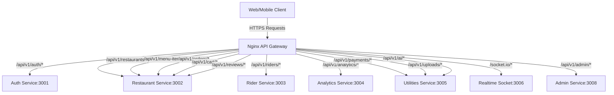
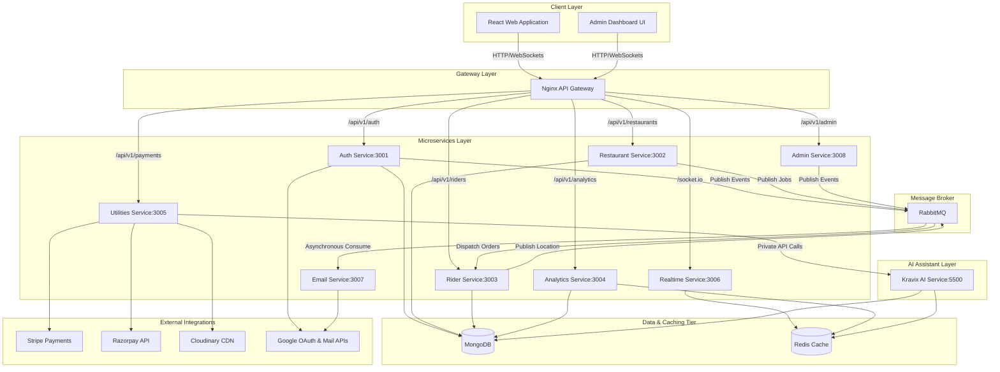
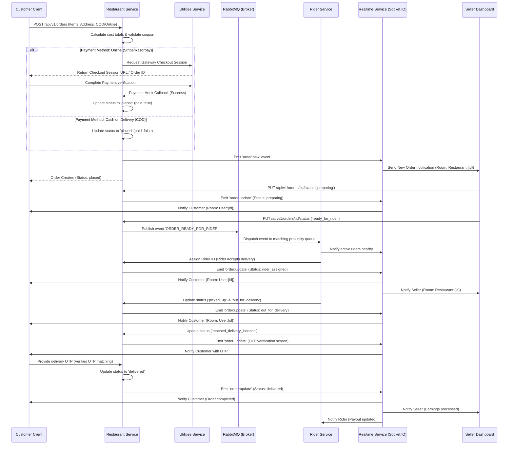
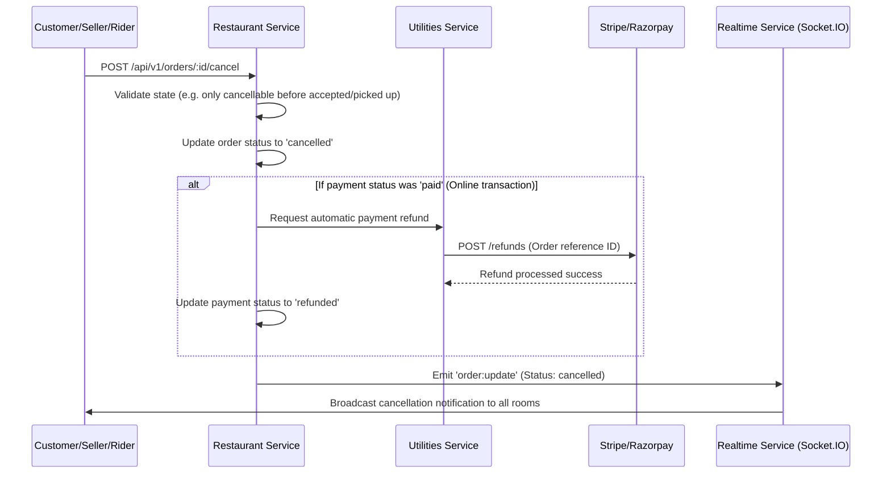
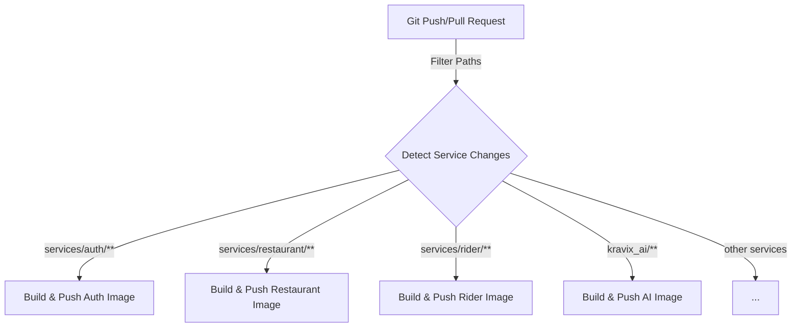

<p align="center">
  
</p>

<h1 align="center">🍛 Kravix — Be Smart, Eat Better</h1>
<p align="center">
  <em>🍔 Craving something delicious? Let's eat again! A production-grade, event-driven online food delivery web application built with a modern TypeScript monorepo architecture.</em>
</p>

---
<p align="center">
  
  
  
  
  
  
  
  
  
</p>

---

## 📖 Table of Contents

- [Project Overview](#project-overview)
- [Strict Prerequisites](#strict-prerequisites)
- [Project Monorepo Structure](#project-monorepo-structure)
- [API Gateway & Routing Architecture](#api-gateway--routing-architecture)
- [System Architecture](#system-architecture)
- [Detailed Lifecycle Flows](#detailed-lifecycle-flows)
- [Database Schemas & Data Model](#database-schemas--data-model)
- [Microservices Architecture](#microservices-architecture)
- [AI Service Deep-Dive](#ai-service-deep-dive)
- [Local Installation & Setup](#local-installation--setup)
- [Environment Configuration](#environment-configuration)
- [Docker Setup & Deployment](#docker-setup--deployment)
- [Testing & Quality Assurance](#testing--quality-assurance)
- [Local Troubleshooting Guide](#local-troubleshooting-guide)
- [CI/CD & Git Flow](#cicd--git-flow)
- [Maintainer & License](#maintainer--license)

---

## 🌟 Project Overview

**Kravix** is a production-grade, microservices-based food delivery platform designed for high scalability, fault tolerance, and automated operations. The platform coordinates real-time interactions across four distinct user roles through modern APIs, asynchronous message queuing, and real-time state synchronization:

*   **Customers**: Geolocation-aware restaurant discovery, dynamic cart pricing, checkout with Stripe/Razorpay, real-time map-based order tracking, and AI-powered recommendations.
*   **Restaurant Sellers**: Menu lifecycle management, real-time order acceptance pipelines, and rich sales analytics.
*   **Riders**: Availability toggles, proximity-based order dispatch, and mobile-friendly delivery verification via secure one-time passwords (OTP).
*   **Administrators**: Global user supervision, system-wide order logs, reviews moderation, and platform coupon distribution.

---

## 🛠️ Strict Prerequisites

Before running Kravix locally, ensure your development environment satisfies the following version constraints. Verify the installations with the corresponding command.

### 🖥️ Local Services & Runtimes

| Prerequisite | Required Version | Verification Command | Description |
| :--- | :--- | :--- | :--- |
| **Node.js** | `>= 22.x` | `node -v` | Backend TypeScript execution & frontend compilation |
| **npm** | `>= 10.x` | `npm -v` | Package dependency management |
| **Python** | `>= 3.11.x` | `python --version` | FastAPI AI service host |
| **MongoDB** | `>= 6.x` | `mongod --version` | Document database (required for location-based queries) |
| **Redis** | `>= 7.x` | `redis-cli --version` | Fast caching and AI session storage |
| **RabbitMQ** | `>= 3.12.x` | `rabbitmqctl version` | Microservice event-driven message broker |
| **Docker Desktop**| `>= 20.10.x` | `docker --version` | Container orchestration and local composition |

### 🔑 External APIs & Credentials
To enable full system functionality, you must configure accounts and obtain developer keys for:
1.  **Google Cloud Platform**: OAuth Client ID/Secret and Gmail API Credentials.
2.  **Stripe**: Developer secret keys for processing payment sessions.
3.  **Razorpay**: API Key ID and Secret for payment order generation.
4.  **Cloudinary**: Cloud Name, API Key, and Secret for menu item and user image hosting.

---

## 📁 Project Monorepo Structure

```
kravix-online-food-dellivery-application/
├── client/                          # React 19 Frontend Web Application
│   ├── src/
│   │   ├── admin/                   # Administrative analytics panel components
│   │   ├── components/              # Shared UI components (common, customer, rider, etc.)
│   │   ├── context/                 # Global Context (App data, Auth state, Socket actions)
│   │   ├── pages/                   # Lazy-loaded router pages
│   │   └── main.tsx                 # Client entry point using Vite
│   └── vite.config.ts               # Bundling optimization, lazy-loading, and gzip plugins
├── services/                        # Node.js TypeScript Microservices
│   ├── auth/                        # User registration, verification, and role distribution
│   ├── restaurant/                  # Restaurant profiles, menus, cart, reviews, and order states
│   ├── rider/                       # Rider location, availability, assignments, and earnings
│   ├── admin/                       # Administrative oversight and platform reviews/coupons
│   ├── analytics/                   # Platform sales, dashboard metrics, and CSV reporting
│   ├── utilities/                   # Payment gateways, Cloudinary uploads, AI service proxy
│   ├── realtime/                    # Socket.IO connection manager & room router
│   └── email/                       # Asynchronous Gmail API job consumer
├── kravix_ai/                       # Python AI Assistant Service
│   ├── api_server.py                # FastAPI endpoints
│   ├── model_manager.py             # quantized LLaMA-3 domain model & fallback loader
│   ├── session_store.py             # Redis-backed session buffer
│   ├── circuit_breaker.py           # Auto-recovery state machine
│   └── requirements.txt             # PyTorch and NLP dependencies
├── .github/                         # GitHub Action pipelines
│   └── workflows/
│       └── docker-build-push.yml    # Incremental docker image compiler
├── License                          # Project license terms
└── README.md                        # Project documentation (this file)
```

---

## 🔀 API Gateway & Routing Architecture

In production, an **Nginx API Gateway** acts as the single public entry point for all incoming traffic. Nginx accepts client connections, terminates SSL/TLS, applies rate limits, and routes path prefixes directly to the corresponding private microservice ports:



> [!NOTE]
> The **Email Service** (Port 3007) and the **Kravix AI Service** (Port 5500) run deep within the private network. Email does not expose public REST routes; it operates strictly as a consumer of RabbitMQ message tasks. The AI Service is proxied securely via the Utilities Service to maintain high network isolation.

---

## 🏗️ System Architecture

The following diagram details the microservices runtime, databases, caches, message brokers, and third-party integrations:



---

## 🔄 Detailed Lifecycle Flows

### 🛒 End-to-End Order & Realtime Status Synchronization
Orders progress through a state machine ensuring that customers, sellers, and riders receive synchronous, zero-latency updates via WebSockets:



### ❌ Order Cancellation & Refund Flow


---

## 🗄️ Database Schemas & Data Model

Kravix uses **MongoDB** as its primary persistent database. Individual schemas are optimized for their domain requirements:

### 1. Users Schema (`Auth Service`)
```typescript
{
  _id: ObjectId,
  name: string,
  email: string,           // Unique, index: true
  image: string,
  role: "customer" | "seller" | "rider" | null,
  isBlocked: boolean,
  blockedUntil: Date | null,
  authProviders: Array<"email" | "google">,
  isEmailVerified: boolean,
  passwordHash: string,    // Selected: false by default
  emailVerificationToken: string,
  emailVerificationExpiry: Date,
  passwordResetToken: string,
  passwordResetExpiry: Date,
  createdAt: Date,
  updatedAt: Date
}
```

### 2. Restaurants Schema (`Restaurant Service`)
```typescript
{
  _id: ObjectId,
  name: string,
  description: string,
  image: string,
  ownerId: string,         // Index: true
  phone: number,
  isVerified: boolean,
  autoLocation: {
    type: "Point",
    coordinates: [number, number], // GeoJSON format. index: '2dsphere'
    formattedAddress: string
  },
  isOpen: boolean,
  createdAt: Date,
  updatedAt: Date
}
```

### 3. Orders Schema (`Restaurant Service`)
```typescript
{
  _id: ObjectId,
  userId: string,          // Index: true
  restaurantId: string,    // Index: true
  restaurantName: string,
  riderId: string | null,  // Index: true
  riderPhoneNumber: number | null,
  riderName: string | null,
  distance: number,
  riderAmount: number,
  items: Array<{
    itemId: string,
    name: string,
    price: number,
    quantity: number
  }>,
  subtotal: number,
  deliveryFee: number,
  platformFee: number,
  discountAmount: number,
  couponCode: string | null,
  totalAmount: number,
  addressId: string,
  deliveryAddress: {
    formattedAddress: string,
    mobile: number,
    customerName: string,
    latitude: number,
    longitude: number
  },
  status: "placed" | "accepted" | "preparing" | "ready_for_rider" | 
          "rider_assigned" | "picked_up" | "out_for_delivery" | 
          "reached_delivery_location" | "delivered" | "cancelled",
  paymentMethod: "razorpay" | "stripe" | "cod",
  paymentStatus: "pending" | "paid" | "failed" | "cod_pending" | "cod_paid" | "cod_failed",
  codPaymentMode: "cash" | "upi" | "card" | "wallet" | null,
  deliveryOtp: string | null,
  expiresAt: Date,         // TTL index: 1 (expiring uncompleted orders)
  createdAt: Date,
  updatedAt: Date
}
```

### 4. Riders Schema (`Rider Service`)
```typescript
{
  _id: ObjectId,
  userId: string,          // Unique, Index: true
  picture: string,
  phoneNumber: string,
  aadhaarNumber: string,
  drivingLicense: string,
  isVerified: boolean,
  location: {
    type: "Point",
    coordinates: [number, number] // index: '2dsphere'
  },
  isAvailable: boolean,
  lastActiveAt: Date,
  totalEarnings: number,
  totalDeliveries: number,
  rating: number,
  ratingCount: number,
  createdAt: Date,
  updatedAt: Date
}
```

---

## ⚡ Microservices Architecture

| Microservice | Default Port | Primary Responsibilities | DB / Cache Bindings | Event Broker Bindings |
| :--- | :--- | :--- | :--- | :--- |
| **Auth** | `3001` | Authentication, OAuth exchange, profile synchronization | MongoDB (Auth DB) | Publishes: User actions |
| **Restaurant** | `3002` | Restaurant registry, menu validation, order pipeline | MongoDB (Rest DB) | Publishes: Order placement |
| **Rider**| `3003` | Proximity routing, availability tracking, payout audits | MongoDB (Rider DB) | Consumes: Dispatch queues |
| **Analytics** | `3004` | Long-term aggregation, sales patterns, CSV exports | MongoDB, Redis Cache | Consumes: Order updates |
| **Utilities** | `3005` | Stripe/Razorpay SDKs, Cloudinary proxy, AI proxy | MongoDB (Util DB) | None (Request-Response) |
| **Realtime** | `3006` | WebSocket server, user/restaurant room broadcasting | Redis Adapter | None (Internal pub/sub) |
| **Email** | `3007` | Google API Gmail dispatch, template processor | None | Consumes: Email queues |
| **Admin** | `3008` | Platform moderations, platform coupons management | MongoDB (Admin DB) | Publishes: Coupon events |

---

## 🧠 AI Service Deep-Dive

The Kravix AI service is powered by a high-performance Python FastAPI runtime acting as a contextual assistant for clients, riders, and sellers.

### 📐 Large Language Model Details
*   **Base Model**: `unsloth/llama-3-8b-bnb-4bit`
*   **Optimization**: 4-bit Quantization (using `bitsandbytes` and `accelerate`) to run inference under minimal VRAM/RAM footprints.
*   **Adapter**: Domain-specific fine-tuned LoRA adapters mapping food categories, traditional Bengali/Indian cuisines (e.g. translating Bengali items: "mangsho" to mutton, "mach" to fish), and delivery policies.

### 🛡️ Production Resilience Features
1.  **Distributed Session Store**: Conversational context is stored in a structured **Redis** database with a set time-to-live (`TTL = 1800` seconds). If Redis goes offline, the service automatically fails over to a local **LRU cache** in-memory.
2.  **Circuit Breaker Pattern**: Wraps model inference calls. If model execution errors out consecutively (e.g., CUDA out-of-memory or API timeouts), the breaker trips, routing queries to a fallback regular-expression matching rule engine (located in [private.md](file:///d:/Web%20Devolopment/kravix-online-food-dellivery-application/private.md)).
3.  **Memory Watchdog**: Background loop checking system host memory. If RAM consumption spikes beyond 90%, it triggers internal garbage collections and unloads unused model weights.
4.  **Observability & Health Checks**: Exposes Prometheus metrics via `/metrics` (tracking inference latency) and detailed health probes `/health` assessing MongoDB, Redis, and Model components.

---

## 📥 Local Installation & Setup

### 1. Repository Acquisition & Node Setup
```bash
# Clone the repository
git clone https://github.com/samratmallick-dev/kravix-food-delivery-application.git
cd kravix-online-food-dellivery-application

# Install frontend dependencies
cd client
npm install
cd ..
```

### 2. Service Dependency Installation
Initialize Node dependencies for all microservices in parallel (or step-by-step):
```bash
# Scripted initialization
cd services
for dir in auth restaurant rider analytics utilities realtime email admin; do
  cd $dir && npm install && cd ..
done
cd ..
```

### 3. AI Service Installation
Set up a Python virtual environment and download packages:
```bash
cd kravix_ai
python -m venv venv

# Windows Command Prompt / PowerShell:
.\venv\Scripts\activate

# Install dependencies
pip install -r requirements.txt
cd ..
```

---

## ⚙️ Environment Configuration

You must create a `.env` file in the root of the `client` directory and inside each subdirectory under `services/` and `kravix_ai/`. Use the following configuration specifications:

<details>
<summary><b>1. Client (.env)</b></summary>

```env
VITE_API_BASE_URL=http://localhost:3000
VITE_AI_SERVICE_URL=http://localhost:5500
VITE_GOOGLE_CLIENT_ID=your-google-client-id.apps.googleusercontent.com
```
</details>

<details>
<summary><b>2. Auth Service (.env)</b></summary>

```env
PORT=3001
MONGODB_URI=mongodb://localhost:27017/kravix_auth
JWT_SECRET=your-jwt-auth-secret-key
JWT_EXPIRES_IN=15d
GOOGLE_CLIENT_ID=your-google-client-id
GOOGLE_CLIENT_SECRET=your-google-client-secret
GOOGLE_REDIRECT_URI=http://localhost:5173/login/google/callback
CLIENT_URL=http://localhost:5173
REALTIME_SOCKET_SERVICE_URI=http://localhost:3006
INTERNAL_SERVICE_KEY=your-secure-internal-microservice-key
EMAIL_QUEUE=email_queue
AUTH_EVENT_QUEUE=auth_event_queue
RABBITMQ_URI=amqp://localhost:5672
```
</details>

<details>
<summary><b>3. Restaurant Service (.env)</b></summary>

```env
PORT=3002
MONGODB_URI=mongodb://localhost:27017/kravix_restaurant
JWT_SECRET=your-jwt-auth-secret-key
CLIENT_URL=http://localhost:5173
REALTIME_SOCKET_SERVICE_URI=http://localhost:3006
INTERNAL_SERVICE_KEY=your-secure-internal-microservice-key
UTILS_SERVICE_URI=http://localhost:3005
ORDER_READY_QUEUE=order_ready_queue
RIDER_QUEUE=rider_queue
RABBITMQ_URI=amqp://localhost:5672
```
</details>

<details>
<summary><b>4. Rider Service (.env)</b></summary>

```env
PORT=3003
MONGODB_URI=mongodb://localhost:27017/kravix_rider
JWT_SECRET=your-jwt-auth-secret-key
REALTIME_SOCKET_SERVICE_URI=http://localhost:3006
INTERNAL_SERVICE_KEY=your-secure-internal-microservice-key
RABBITMQ_URI=amqp://localhost:5672
```
</details>

<details>
<summary><b>5. Analytics Service (.env)</b></summary>

```env
PORT=3004
MONGODB_URI=mongodb://localhost:27017/kravix_analytics
JWT_SECRET=your-jwt-auth-secret-key
REDIS_URL=redis://localhost:6379
INTERNAL_SERVICE_KEY=your-secure-internal-microservice-key
```
</details>

<details>
<summary><b>6. Utilities Service (.env)</b></summary>

```env
PORT=3005
MONGODB_URI=mongodb://localhost:27017/kravix_utilities
JWT_SECRET=your-jwt-auth-secret-key
CLOUDINARY_CLOUD_NAME=your-cloudinary-name
CLOUDINARY_API_KEY=your-cloudinary-api-key
CLOUDINARY_API_SECRET=your-cloudinary-api-secret
STRIPE_SECRET_KEY=your-stripe-secret-key
RAZORPAY_KEY_ID=your-razorpay-key-id
RAZORPAY_KEY_SECRET=your-razorpay-key-secret
CLIENT_URL=http://localhost:5173
RESTAURANT_BASE_URL=http://localhost:3002
INTERNAL_SERVICE_KEY=your-secure-internal-microservice-key
AI_SERVICE_URL=http://localhost:5500
```
</details>

<details>
<summary><b>7. Realtime Service (.env)</b></summary>

```env
PORT=3006
JWT_SECRET=your-jwt-auth-secret-key
INTERNAL_SERVICE_KEY=your-secure-internal-microservice-key
REDIS_URL=redis://localhost:6379
```
</details>

<details>
<summary><b>8. Email Service (.env)</b></summary>

```env
PORT=3007
INTERNAL_SERVICE_KEY=your-secure-internal-microservice-key
RABBITMQ_URI=amqp://localhost:5672
EMAIL_QUEUE=email_queue
GMAIL_CLIENT_ID=your-google-oauth-client-id
GMAIL_CLIENT_SECRET=your-google-oauth-client-secret
GMAIL_REDIRECT_URI=http://localhost:3007/auth/google/callback
GMAIL_REFRESH_TOKEN=your-google-api-refresh-token
CLIENT_URL=http://localhost:5173
```
</details>

<details>
<summary><b>9. Admin Service (.env)</b></summary>

```env
PORT=3008
MONGODB_URI=mongodb://localhost:27017/kravix_admin
JWT_SECRET=your-jwt-auth-secret-key
ADMIN_JWT_SECRET=your-admin-only-jwt-secret-key
INTERNAL_SERVICE_KEY=your-secure-internal-microservice-key
RABBITMQ_URI=amqp://localhost:5672
```
</details>

<details>
<summary><b>10. AI Service (.env)</b></summary>

```env
PORT=5500
REDIS_URL=redis://localhost:6379
MONGODB_URI=mongodb://localhost:27017/kravix_ai
DB_NAME=kravix_db
SESSION_TTL_SECONDS=1800
MAX_SESSIONS=500
PROMPT_TOKEN_LIMIT=6000
MAX_HISTORY_TURNS=10
ENABLE_FEEDBACK=false
MOCK_MODE=true
```
</details>

---

## 🐳 Docker Setup & Deployment

Docker Compose orchestrates the infrastructure alongside all microservices in a unified network.

### 1. Build Container Images Local Scripts
Generate Docker builds for the frontend client and each backend service locally:
```bash
# Build Frontend Client
cd client && docker build -t kravix-client . && cd ..

# Build Services Loop
for service in auth restaurant rider analytics utilities realtime email admin; do
  docker build -t kravix-$service ./services/$service
done

# Build AI Service
docker build -t kravix-ai ./kravix_ai
```

### 2. Launch Local Containers
Create a `docker-compose.yml` configuration (provided in [Docker Setup section](README.md#docker-setup)) at the root of the project. Then execute:
```bash
# Start all containers in background mode
docker-compose up -d

# Audit logs for all running services
docker-compose logs -f
```

---

## 🧪 Testing & Quality Assurance

Production deployments require validating changes against unit and integration test suites.

### 🧪 Express Microservices (Node.js)
The Express APIs use Jest/Mocha runner configurations. Execute these commands to run scripts inside the service directories:
```bash
# Run unit tests inside Auth Service
cd services/auth && npm run test

# Run integration tests for Order transitions
cd services/restaurant && npm run test
```

### 🐍 AI Assistant Service (Python)
The python backend utilizes FastAPI's `TestClient` class combined with mock inputs.
*   Run the verification script to validate prompt processing logic:
```bash
cd kravix_ai
python api_server.py --test
```
This runs the internal verification test cases mapping food recommendations, data privacy compliance, and OTP handoffs.

---

## 🛑 Local Troubleshooting Guide

When running multiple services concurrently, developers might encounter environment bugs. Below are strategies to debug local instances:

### 1. Port Collisions
Each microservice occupies a specific port (3001-3008, 5500, 5173). If a port is occupied:
```powershell
# Windows PowerShell (Identify and kill process occupying Port 3002)
netstat -ano | findstr :3002
# Output: TCP 0.0.0.0:3002  0.0.0.0:0  LISTENING  12345 (PID)
Stop-Process -Id 12345 -Force
```

### 2. Startup Order Dependencies
Always start the persistence tier first. Ensure the databases and brokers are fully active before running microservice scripts:
1.  **MongoDB** (Port `27017`)
2.  **Redis** (Port `6379`)
3.  **RabbitMQ** (Port `5672`)
4.  **Backend services** (Ports `3001-3008`)
5.  **Frontend app** (Port `5173`)

### 3. RabbitMQ Message Queue Flush
If queues get jammed or hold stale jobs during local testing, purge them via CLI:
```bash
# Purge all messages from a specific queue
rabbitmqctl purge_queue order_ready_queue

# Reset RabbitMQ to default fresh state
rabbitmqctl stop_app
rabbitmqctl reset
rabbitmqctl start_app
```

### 4. Redis Session Timeouts
If the AI service disconnects from Redis, check the connection status. Note that the service will print an alert `REDIS CONNECTIVITY FAILED - FALLING BACK TO LOCAL LRU` to console and continue processing using the local fallback engine without breaking the application logic.

---

## 🚀 CI/CD & Git Flow

Kravix uses **GitHub Actions** (`.github/workflows/docker-build-push.yml`) to orchestrate incremental Docker image builds. 



### 🚀 Key Pipeline Actions
*   **Incremental Change Detection**: Utilizes `dorny/paths-filter` to detect code changes. Only the service directories with modified files trigger their respective build jobs, minimizing CI time.
*   **Automatic Hub Pushing**: Built images are pushed automatically to the Docker Hub Registry on successful merge to `main`.
*   **Required Configuration Secrets**: Add `DOCKERHUB_USERNAME` and `DOCKERHUB_TOKEN` variables inside your repository Github Actions Secrets.

---

## 👥 Maintainer & License

### 👨‍💻 Primary Maintainer
**Samrat Mallick**
*   📍 Habra, West Bengal-743263, India.
*   📧 Email: [samratmallick832@gmail.com](mailto:samratmallick832@gmail.com)
*   💼 Linkedin: [Samrat Mallick](https://www.linkedin.com/in/samrat-mallick01)
*   💻 Portfolio: [samratmallick.dev](https://myportfolio-io-dusky.vercel.app)
*   🐙 GitHub: [@samratmallick-dev](https://github.com/samratmallick-dev)

### 📄 License
This codebase is distributed under the terms of the MIT License. For details, refer to the [License](License) file.